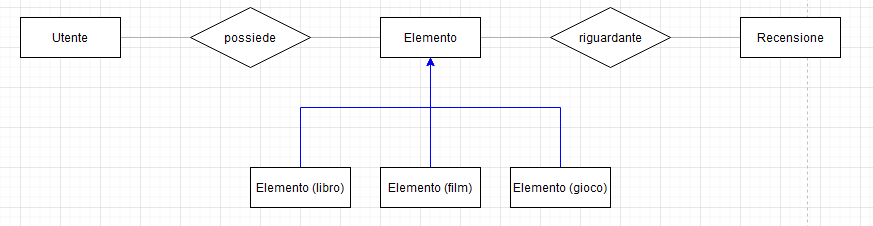
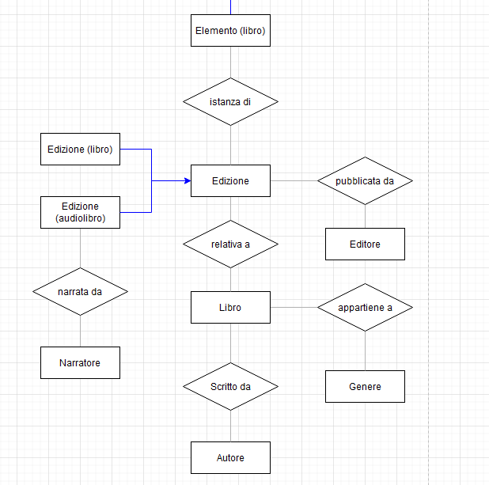
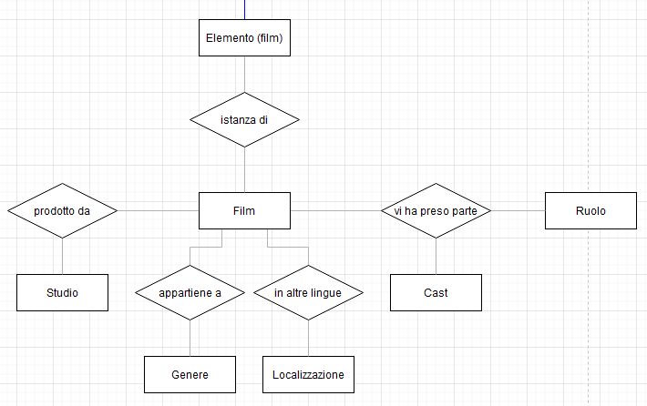
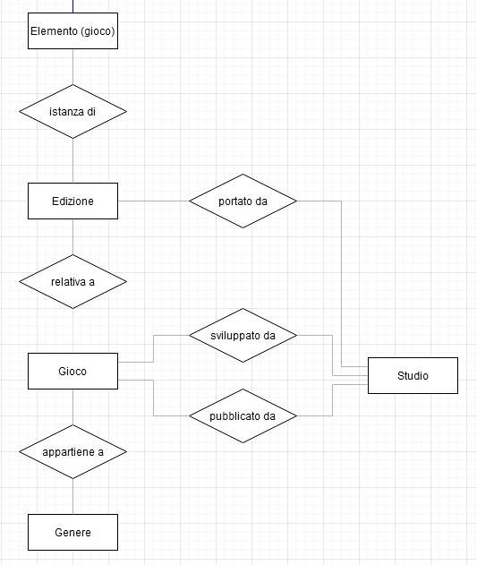

# Schema scheletro

Dal glossario, si è poi realizzato con il software [diagrams.net](https://www.diagrams.net/) uno schema scheletro della base di dati, contenente le principali entità e relazioni.

È allegato alla relazione il file [`3-1-schema-scheletro.drawio`](3-1-schema-scheletro.drawio) contenente l'intero schema scheletro in un formato modificabile; per comodità, si riportano qui sotto i suoi contenuti sotto forma di immagini.

## Legenda

I _quadrati_ rappresentano le **entità**, i _rombi_ rappresentano le **relazioni**, le _linee continue grigie_ rappresentano l'**appartenenza** di un'entità a una relazione e infine le _frecce blu_ rappresentano l'esistenza di una [**gerarchia IsA**](3-2-gerarchie.md) tra le entità connesse.

## Immagini

### Generale

### Libri

### Film

### Giochi

