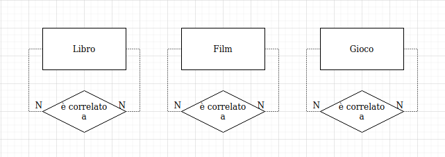

# Classificazione delle autoassociazioni

In  `alexandria`, sono presenti tre autoassociazioni che rappresentano tutte e tre lo stesso concetto: ogni libro, film o videogioco può essere associato ad altre entità del suo stesso tipo a cui è correlato. 

> Inizialmente, si è considerato di aggiungere una unica autoassociazione alla entità Elemento, ma si è poi giunti alla conclusione che questo approccio sarebbe stato sbagliato: si sarebbero dovuti associare tutti i singoli Elementi creati da ciascun Utente, creando una quantità a crescita esponenziale di correlazioni!
