# Schema scheletro finale

Dopo aver costruito [lo schema scheletro](3-1-schema-scheletro.md), identificato [le gerarchie](3-2-gerarchie.md) e [le autoassociazioni](3-3-autoassociazioni.md), si è passati a ultimare lo schema relazionale, aggiungendoci **attributi**, **identificatori** e **cardinalità delle relazioni**.

Per farlo, ci si è basati sui contenuti della [descrizione](1-descrizione.md) e del [glossario](2-glossario.md): per comodità, si riportano qui le frasi della descrizione relative alle entità di cui si parla.

È allegato alla relazione il file [`3-4-schema-finale.drawio`](3-4-schema-finale.drawio): esso contiene lo schema scheletro finale di cui si vedono le immagini in questo capitolo.

## Legenda

<!--TODO: Forse dovremmo rifarla scrivendo Identificatore invece che Chiave primaria?-->

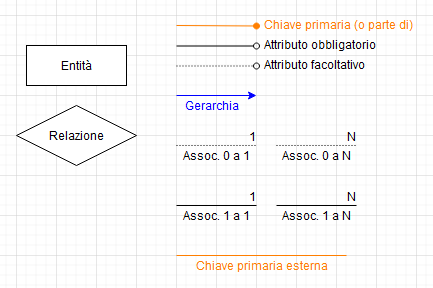

## `Utenti`

> Chiunque può registrarsi al sito web scegliendo un username univoco e inserendo una password segreta (sarà [hashata](https://it.wikipedia.org/wiki/Funzione_di_hash) con l'algoritmo [bcrypt](https://it.wikipedia.org/wiki/Bcrypt) prima che venga inserita nel database), creando così un utente.
>
> Esisterà una tipologia particolare di utente: l'utente **amministratore**.
> 
> Inoltre, potranno decidere di __bannare__ utenti dal sito, impedendo loro di effettuare l'accesso e di conseguenza di interagire con la loro raccolta.

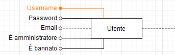

Per gli `Utenti`, si sono aggiunti gli attributi all'entità seguendo strettamente le specifiche, assieme a un attributo opzionale "email" per permettere un eventuale recupero dell'account nel caso che ci si sia dimenticati la password.

## `Elementi`

> Gli utenti potranno aggiungere _elementi_ alla loro raccolta multimediale.
>
> Un elemento rappresenta una copia di un libro, di un film o di un videogioco posseduta da un utente.
>
> Ogni elemento avrà associato uno **stato** da una lista di opzioni diversa per ogni tipologia: [...]
>
> Inoltre, ogni elemento avrà associata una **provenienza** da un'altra lista: [...]

> Un utente potrà lasciare una recensione ad ogni elemento presente nella sua raccolta.
>
> La recensione sarà composta da una valutazione (tra 0 e 100, dove 100 è la valutazione migliore), un commento e la data di pubblicazione.

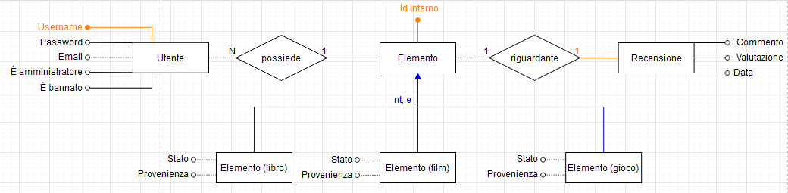

### Sottoentità

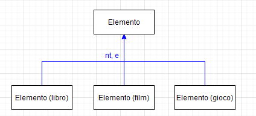

Gli `Elementi` sono stati suddivisi in tre sottoentità `Elemento (libro)`, `Elemento (film)` ed `Elemento (gioco)` per permettere loro di possedere attributi e relazioni di tipo diverso gli uni dagli altri; infatti, ognuna delle tre sottoentità è dotata di una associazione `istanza di` che le collega rispettivamente alle entità `Edizione (libro)`, `Film` e `Edizione (gioco)`.

Attributi e relazioni di queste sottoentità saranno descritti nelle sezioni successive.

### `Recensioni`

Le `Recensioni` sono collegate agli `Elementi` attraverso la relazione `riguardante`.

Sono un caso di **identificatore esterno**: le `Recensioni` infatti usano come identificatore l'_id_ dell'`Elemento` a cui si riferiscono. 

Si può inoltre dire che le `Recensioni` siano una **entità debole** rispetto agli `Elementi`, in quanto senza il suo relativo `Elemento`, una `Recensione` perderebbe importanti informazioni di contesto, e non avrebbe quindi più senso di esistere (infatti, senza `Elemento`, essa non sarebbe più dotata di un identificatore).

## `Libri`

> Ogni libro avrà una sua pagina in cui sarà presente il titolo originale, gli autori, i generi, un breve riassunto della trama, l'elenco di tutte le sue edizioni (sia in formato libro sia in formato audiolibro) e [...].
> 
> Ciascuna edizione del libro avrà una seconda pagina con ulteriori informazioni, quali il suo titolo, la copertina, la casa editrice e il numero di pagine; ciascuna edizione sarà identificata da il relativo [codice ISBN](https://it.wikipedia.org/wiki/ISBN).
> 
> Le edizioni in formato audiolibro avranno attributi diversi: invece che avere il numero di pagine e la copertina, essi avranno la durata in minuti e secondi della registrazione e opzionalmente un'immagine che rappresenti l'audiolibro.

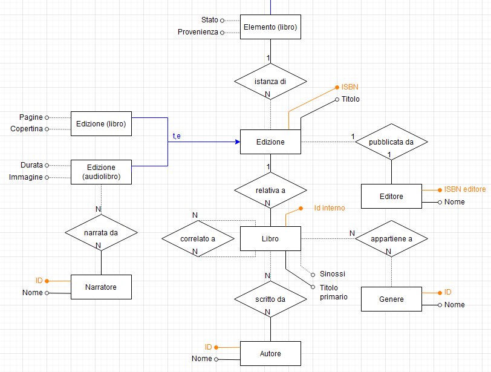

Lo schema dei `Libri` è stato realizzato seguendo in buona parte le specifiche; si sono però effettuate alcune aggiunte:
- Le `Edizioni` di un `Libro` sono state dotate di un _titolo_, che rappresenta il titolo dell'`Edizione` specifica (titolo in una lingua diversa, edizione speciale che cambia il titolo, etc...);
- Le `Edizioni` di un `Audiolibro` possono avere associato uno o più `Narratori`.

### Una ricorrenza nelle relazioni: il pattern "1NN0"

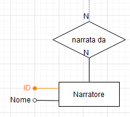
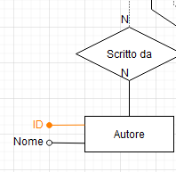

Osservando lo schema, si nota che le relazioni "narrata da" e "scritto da" sono molto simili tra loro: tutte e due sono **0 a N** nel lato che si collega all'opera (il `Libro` o una sua `Edizione`), sono **1 a N** dall'altro lato e si ricollegano a una entità con due soli attributi, _Nome_ e _ID_.

Questa particolare struttura compare in molte parti dello schema relazionale: per evitare di ridescriverla ogni volta e per permettere invece di referenziarla, si è deciso di darle il nome **1NN0** (leggi: "inno").

<!--Il nome gliel'ho dato io, dici che può andare bene?-->

<!--Urgh. Questo paragrafo mi fa schifo. Come si potrebbe riscrivere?-->

È stata scelta la cardinalità **0 a N** dal lato dell'opera, in modo da evitare agli utenti la compilazione obbligatoria di tutti i campi di un opera al momento della sua aggiunta, ma permettendo una compilazione più dettagliata in futuro, prevedendo anche casi in cui ad esempio un libro sia stato scritto da più autori.

Dato che si è voluto rendere possibili query come "quali `Libri` ha scritto questo autore" o "quali `Libri` ha narrato questo narratore" e che inserire nel database autori o narratori a cui non appartiene nessun libro non avrebbe alcun senso, si è scelto invece di usare una cardinalità **1 a N** dall'altro lato della relazione.

Infine, per l'entità connessa al lato _1 a N_ della relazione, si è deciso di usare un **ID interno** come identificatore, in modo da permettere la modifica del _Nome_ associato senza dover andare a modificare tutte le opere.

### `Generi`

Notiamo che la relazione che associa un `Libro` a un `Genere` è molto simile alla struttura _1NN0_, ma essa ha una cardinalità **0 a N** anche dal lato dell'entità `Genere`.

Questo perchè si intende aggiungere alcuni `Generi` al database tra cui gli utenti potranno scegliere prima ancora che esistano dei libri.

### `Editori`

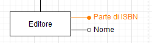

Tutti i codici ISBN contengono al loro interno [un codice univoco che identifica l'editore](https://it.wikipedia.org/wiki/ISBN#Editore) di un libro; si è quindi deciso di usare questo codice per identificare l'entità `Editore`.

### Correlazioni 

> [...] e opzionalmente una lista di opere correlate (sequel, prequel, libri ambientati nello stesso universo, etc)

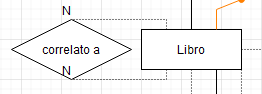

Come menzionato [in precedenza](3-3-autoassociazioni.md), l'entità `Libro` è dotata di una autoassociazione che permette di identificare gli altri `Libri` ad essa correlati.

## `Film`

> Ogni film avrà una sua pagina in cui sarà presente il titolo originale, i titoli nelle varie lingue (identificati dal [codice ISO 639 della lingua](https://en.wikipedia.org/wiki/List_of_ISO_639-1_codes)), una sinossi della trama, la durata, la casa produttrice, il cast, e, come per i libri, una lista opzionale di pellicole correlate.
> 
> I film saranno identificati dal loro [codice EIDR](https://ui.eidr.org/search), e per ciascuno di essi verrà calcolata la valutazione media dalle recensioni, che sarà visualizzata sulla pagina assieme a un campione di recensioni.

### Il pattern _1NN0_ nei `Film`

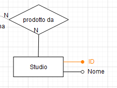

Nello schema dei `Film`, si può notare il pattern _1NN0_, in corrispondenza alla relazione `prodotto da`.

### `vi ha preso parte`: una relazione _1NN0_ ternaria

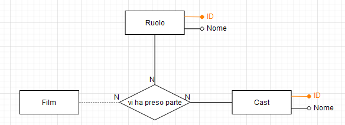

Nello schema dei film è presente la **relazione ternaria** `vi ha preso parte`.  
Essa associa una persona (`Cast`) a un `Film`, specificando il `Ruolo` ("attore", "regista", "sceneggiatore"...) per cui vi ha preso parte. 

È stata modellata in questo modo per consentire query avanzate sul cast di un `Film`: ad esempio, "in quali film Quentin Tarantino ha avuto il ruolo di regista", oppure "che ruoli ha ricoperto Johnny Depp nei film usciti dopo il 2010".

### `Generi`

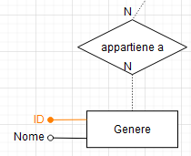 

Come per i `Libri`, l'entità `Genere` è coinvolta in una _1NN0_ con cardinalità **0 a N** dal lato del `Genere`.

### Correlazioni 

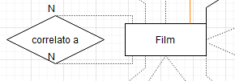

Come i `Libri`, anche i `Film` hanno un'autoassociazione per determinare le pellicole correlate.

### Localizzazione

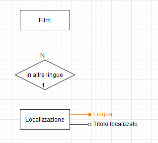

Simile al pattern _1NN0_, ma fondamentalmente diversa è la relazione `in altre lingue`: essa ha cardinalità _0 a N_ dal lato dei `Film`, e _1 a 1_ dal lato dell'entità `Localizzazione`; in più, l'associazione è identificatore esterno di `Localizzazione`.

L'entità `Localizzazione` rappresenta il **titolo** di un `Film` tradotto in una lingua: ad esempio, _Il Padrino_ è una localizzazione in "`it`" (italiano) del `Film` _The Godfather_.  
La sua chiave è composta dal codice ISO della lingua a cui si riferisce e dall'identificatore del `Film` a cui essa si riferisce: è dunque una **entità debole**.

> Nei `Libri` e nei `Giochi` non è stato necessario creare questa entità perchè nei `Libri` lingue diverse hanno codici ISBN diversi (e quindi è possibile inserire i titoli localizzati all'interno dell'entità `Edizione`), e per i `Giochi` è molto raro avere titoli tradotti. 

## `Giochi`

> Ogni videogioco avrà una sua pagina in cui sarà presente il titolo, lo sviluppatore, il publisher, una breve descrizione del gioco, l'elenco di tutte le piattaforme in cui esso è disponibile e, come per libri e film, un elenco di altri giochi correlati.
> 
> Per ogni piattaforma sarà disponibile una sottopagina, che conterrà la [box art](https://vgboxart.com/) di quella versione, il nome dello studio che ha effettuato il [porting](https://en.wikipedia.org/wiki/Porting#Porting_of_video_games) ed eventualmente il titolo [se diverso da quello principale](https://it.wikipedia.org/wiki/Payday_2#Crimewave_Edition). 

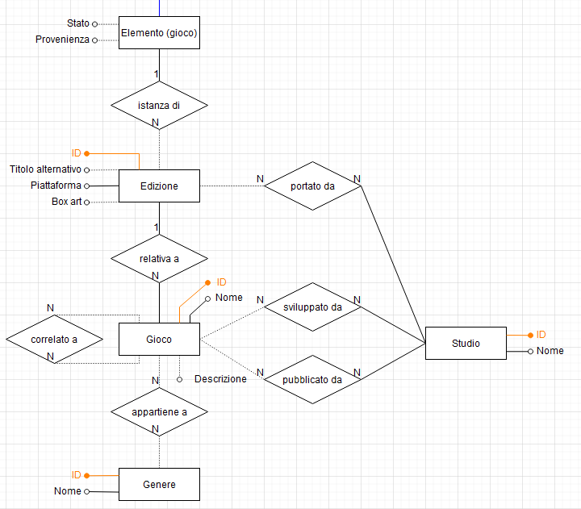

### `Edizioni`

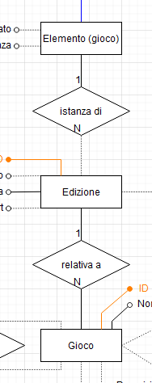

Quelle che [nella descrizione](/1-descrizione.md) vengono chiamate _sottopagine_ sono state realizzate nello schema attraverso l'entità `Edizione`: una `Edizione` rappresenta una versione di un gioco pubblicata su una specifica piattaforma (PC, PS4, Xbox One, etc...).

Come per gli `Elementi (libro)`, gli `Elementi (gioco)` saranno istanziati relativamente a una specifica `Edizione` di un gioco.

### Il pattern _1NN0_ nei `Giochi`

Il pattern _1NN0_ è presente anche all'interno dello schema dei `Giochi`: si può notare nelle relazioni `sviluppato da`, `pubblicato da` e `portato da`.

### `Generi`

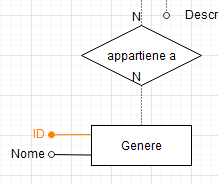

Come i `Libri` e i `Film`, anche i `Giochi` hanno una relazione `appartiene a` che li collega a uno o più `Generi`.

### `Giochi` correlati

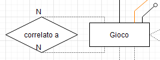

Ancora, anche i `Giochi` hanno un'autoassociazione per determinare le correlazioni tra di essi.
