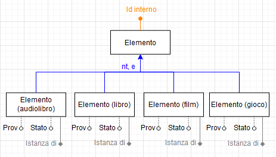

# Eliminazione delle gerarchie

Per effettuare la progettazione logica è necessaria come prima cosa rimuovere le gerarchie IsA createsi [durante la fase di progettazione concettuale](3-2-gerarchie.md).

Si ricorda che in `alexandria` sono presenti due gerarchie: una sugli Elementi e una sulle Edizioni dei libri.

## Gerarchia delle Edizioni

La gerarchia delle Edizioni è una gerarchia **totale** ed **esclusiva**; gli approcci possibili sono dunque 4:

- **Mantenimento delle entità**: Un'opzione sempre possibile, ma che porta a un numero di accessi maggiore e quindi a una velocità di interrogazione minore rispetto alle due alternative.

- **Collasso verso l'alto**: Essendo una relazione esclusiva, collassarla verso l'alto porterebbe ad _almeno_ un 50% di valori nulli nella tabella Edizione risultante, portando a un significativo spreco di memoria.
 
- **Collasso verso l'alto con unione**: Sarebbe possibile effettuare il _collasso verso l'alto_ unendo però le coppie di attributi `{"Copertina", "Immagine"}` e `{"Pagine", "Durata"}` (facendo riferimento rispettivamente alle pagine del libro e ai secondi dell'audiolibro) per rendere 0 i valori nulli introdotti nella tabella, a costo di parte dell'integrità della base di dati.

- **Collasso verso il basso**: Porterebbe alla duplicazione dell'entità Edizione e delle associazioni 1 a N con cardinalità N dal lato di Edizione; si creerebbe un nuovo tipo di Elemento, "Elemento (audiolibro)".

Si è deciso di **collassare la gerarchia verso il basso** perchè si è reputato importante mantenere integra, veloce e compatta la base di dati, a costo di maggiore complessità progettuale.

## Gerarchia degli Elementi

La gerarchia degli Elementi è **non totale** ed **esclusiva**. Possiamo dunque applicare i seguenti approcci:

- **Mantenimento delle entità**: Un'opzione sempre possibile, ma che porta a un numero di accessi maggiore e quindi a una velocità di interrogazione minore rispetto alle due alternative.

- **Collasso verso l'alto**: Collassare direttamente verso l'alto sarebbe l'opzione peggiore, in quanto aggiungerebbe 12 nuovi attributi con _almeno_ il 75% dei valori nulli (più un selettore), sprecando più memoria del necessario.

- **Collasso verso l'alto con unione**: Per minimizzare i valori nulli, si potrebbero unire gli attributi `{"Provenienza", "Stato"}` in uno unico, verificando che vengano inseriti valori validi attraverso vincoli di integrità; in questo caso, si introdurrebbero solo 4 nuovi attributi ("istanza di"), con però comunque _almeno_ il 75% di valori nulli, costando memoria (ma meno di quanta se ne sarebbe spesa in un normale collasso).

- **Collasso verso il basso**: Porterebbe alla creazione di quattro tabelle "Elemento" e a quattro tabelle "Recensione" relative a ogni tipo di Elemento, aumentando la complessità progettuale.

Anche qui si è deciso di **collassare la gerarchia verso il basso**, in quanto il collasso verso il basso favorisce le entità molto specializzate come gli Elementi; inoltre, adottare il collasso verso il basso permette di espandere con facilità il database in futuro per aggiungerci altri tipi di elementi, in quanto basterà creare due nuove tabelle "Elemento (tipo)" e "Recesione (tipo)".
