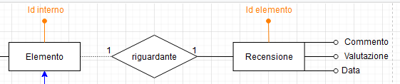
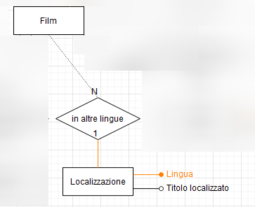
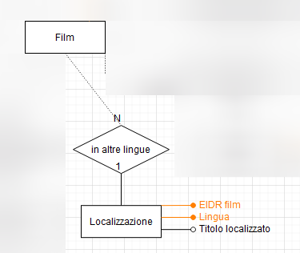

# Eliminazione delle chiavi esterne

In Alexandria sono presenti solo due chiavi esterne: una nelle entità Recensione e l'altra nell'entità Localizzazione.

## Eliminazione della chiave di Recensione

In questo caso, si è aggiunto a Recensione l'attributo "ID elemento", che corrisponderà all'ID dell'elemento a cui si riferisce:

## Eliminazione della chiave di Localizzazione

Anche in questo caso si è trasformata la chiave esterna in un attributo "EIDR film" che corrisponderà all'EIDR del film il cui titolo è stato tradotto.

