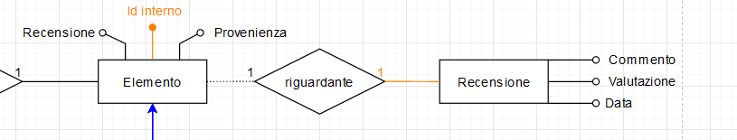

# Identificazione delle chiavi primarie esterne

In `alexandria`, ogni utente potrà pubblicare una recensione riguardante un qualsiasi elemento della sua libreria (libro, film, videogioco...), con un testo e una valutazione da 0 a 100. 

Le recensioni di ogni utente saranno visualizzate nella pagina del libro, film o videogioco che esse riguardano, e nella pagina del profilo dell'utente che le ha pubblicate.

Si è pensato sarebbe stato appropriato permettere alle recensioni di essere associate agli elementi della libreria di ogni utente.

Essendo la relazione `riguardante` tra `Elemento` e `Recensione` una relazione _opzionale_ 1 a 1, si è deciso di utilizzare come chiave dell'entità `Recensione` l'ID (chiave primaria) dell'`Elemento` che riguarda.

Questa scelta rende semplici e veloci le interrogazioni per trovare recensioni create da uno specifico utente e recensioni riguardanti un dato libro, film o videogioco: in entrambi i casi, è richiesto l'uso di un solo `JOIN`.
