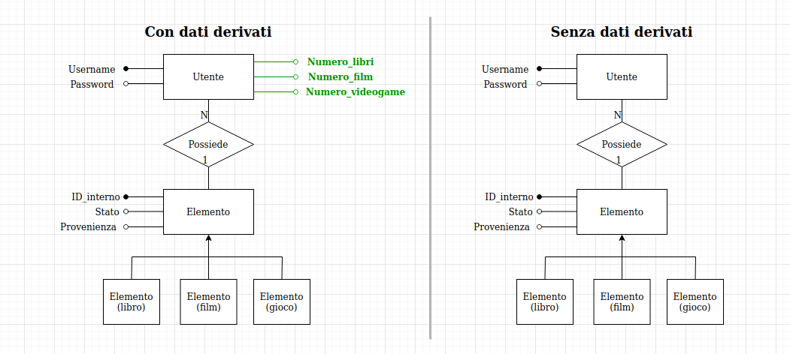

# Caso di studio: aggiunta di un dato derivato

In `alexandria` non sono presenti molti dati quantitativi: la maggior parte delle proprietà sono infatti qualitative, e come tali descritte da stringhe. Un dato derivato aggiungibile, però, è il numero di libri, film o videogame presenti nella libreria multimediale di un utente.

Per sapere se conviene mantenere questo dato derivato, effettuiamo un'analisi dei costi:

## Analisi dei costi

*(Ndr: in seguito verranno calcolati i costi di mantenimento solo di uno dei tre dati derivati, perché il costo e il procedimento sono sempre gli stessi.)*

Valuteremo il costo di due operazioni:
- Operazione 1: Inserimento di un nuovo libro/film/videogame nella tabella
- Operazione 2: Visualizzazione dei dati di un utente, compreso il numero di libri/film/videogame presenti nella sua libreria multimediale

Le tabelle dei volumi sono state create in base a statistiche trovate ricercando online: Ogni anno in media una persona legge 12 libri, guarda 60 film e compra 24 videogame, per un totale di  96 elementi per ogni utente, circa. Immaginandoci 100 utenti, avremo quindi 9600 elementi:

| Concetto | Tipo | Volume |
|----------|:----:|-------:|
| Utente   |   E  | 100    |
| Elemento |   E  | 9600   |

La tabella degli accessi non sarà ricavata: i dati verranno analizzati in funzione di quest'ultima come conclusione.

### Con dato derivato:
Operazione 1: Inserisco una nuova tupla nella tabella Elemento, e poi aggiorno l'apposito attributo nella tabella Utente, passando per l'associazione Possiede.

Ogni elemento è posseduto da un unico utente, quindi l'associazione in questo caso è 1 a 1. Ne segue che occorreranno un aggiornamento per Possiede e uno per Utente, quindi due aggiornamenti in tutto.

1 write + (2 read + 2 write) = 7 per operazione

Operazione 2: Leggo il dato dalla tabella Utente

1 read = 1

### Senza dato derivato:
*Operazione 1*: Inserisco una nuova tupla nella tabella elemento, senza aggiornare altro

1 write = 2 per operazione

Operazione 2: Passando per l'associazione Possiede, calcolo la quantità di elementi del tipo desiderato. Poniamo che, per calcolare la quantità di elementi che soddisfano una condizione, sia necessario e sufficiente leggerli tutti.

Ogni utente possiede in media N elementi, quindi occorreranno un numero 2*N di operazioni read (N per l'associazione e N per l'entità). N, ossia la cardinalità di passaggio, verrà calcolato in base alla tabella dei volumi fra Utente e Possiede:

Card(Utente -> Possiede) = Vol(Possiede) / Vol(Utente)

Vol(Utente) = 100

Vol(Possiede) = Vol (Elemento) = 9600

Card(Utente -> Possiede) = 9600 / 100 = 96

Il costo sarà quindi

96 read = 96 per operazione

## Risultato finale

Abbiamo calcolato i costi singoli di ciascuna operazione, adesso calcoliamo quale rapporto devono avere le due operazioni perché convenga il dato derivato.

Al momento abbiamo queste due equazioni che rappresentano i costi totali:

CostoCon: 7 * Op1 + 2 * Op2

CostoSenza: 2 * Op1 + 96 * Op2

Dove Op1 e Op2 sono rispettivamente la frequenza di esecuzione dell'operazione 1 e dell'operazione 2, e CostoCon e Costosenza sono le equazioni dei costi con e senza il dato derivato.

Ponendo CostoCon < CostoSenza e facendo tutti i calcoli del caso, risulta che il rapporto fra Op1 e Op2 deve essere strettamente minore di 94/5. Ne consegue che, perché convenga tenere il dato derivato, le operazioni di inserimento di un nuovo dato devono essere al massimo 19 volte di più delle operazioni di visualizzazione. 